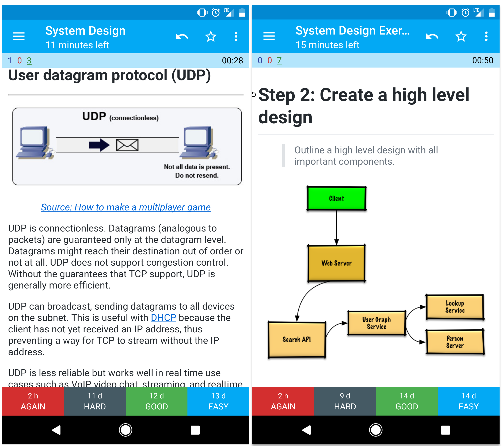

### System design interview

* [Understand what is system design interview about](study_guide.md#understand-what-is-system-design-interview-about)
* [Study guide](study_guide.md#study-guide)
* [How to approach a system design interview question](study_guide.md#how-to-approach-a-system-design-interview-question)
* [System design interview questions, **with solutions**](study_guide.md#system-design-interview-questions-with-solutions)
* [Object-oriented design interview questions, **with solutions**](study_guide.md#object-oriented-design-interview-questions-with-solutions)
* [Additional system design interview questions](15_interview_questions.md#additional-system-design-interview-questions)

#### External sites
* [Low-level system design interview questions **with solutions**](https://github.com/prasadgujar/low-level-design-primer)
* [System design interview questions](https://www.interviewbit.com/system-design-interview-questions/)

### Practice interactively 
The original repo used Anki - but it will be replaced soon with more modern platform:

*Anki* is a platform and tool for memorization using spaced repetition.
*Anki deck* is a collection of flashcards grouped under a single topic or category.
Anki uses: A form of the SM2 spaced repetition algorithm, originally developed for SuperMemo.
The algorithm:
- Adjusts when you see a card based on how well you recall it.
- Cards you get wrong are shown sooner.
- Cards you remember easily are delayed further (days, then weeks, then months).

The provided [Anki flashcard decks](https://apps.ankiweb.net/) use spaced repetition to help you retain key system design concepts.

See **[Guide to Using Anki Decks](anki_guide.md)** for instructions on how to download and import these files.

*   [System Design Deck](../../resources/flash_cards/System%20Design.apkg?raw=true)
*   [System Design Exercises Deck](../../resources/flash_cards/System%20Design%20Exercises.apkg?raw=true)
*   [Object Oriented Design Exercises Deck](../../resources/flash_cards/OO%20Design.apkg?raw=true)

Great for use while on-the-go.

  
   

  
   

  
   

#### Coding Resource: Interactive Coding Challenges

Looking for resources to help you prep for the [**Coding Interview**](https://github.com/donnemartin/interactive-coding-challenges)?

Check out the original sister repo [**Interactive Coding Challenges**](https://github.com/donnemartin/interactive-coding-challenges), which contains an additional Anki deck:

* [Coding deck](https://github.com/donnemartin/interactive-coding-challenges/tree/master/anki_cards/Coding.apkg)

For an alternative collection of Anki decks tailored specifically to developers, check out [Ankicode by daveight](https://github.com/daveight/ankicode)—a powerful resource that offers curated flashcards covering programming, algorithms, and other technical topics.

### Learn from the open source community

This is a continually updated, open source project.

[Contributions](#contributing) are welcome!

## Contributing

> Learn from the community.

Feel free to submit pull requests to help:

* Fix errors
* Improve sections
* Add new sections
* [Translate](../../TRANSLATIONS.md)

Content that needs some polishing is placed [under development](17_under_development.md#under-development).

Review the [Contributing Guidelines](../../CONTRIBUTING.md).

## System Design Architecture Example

  
   

  
   

