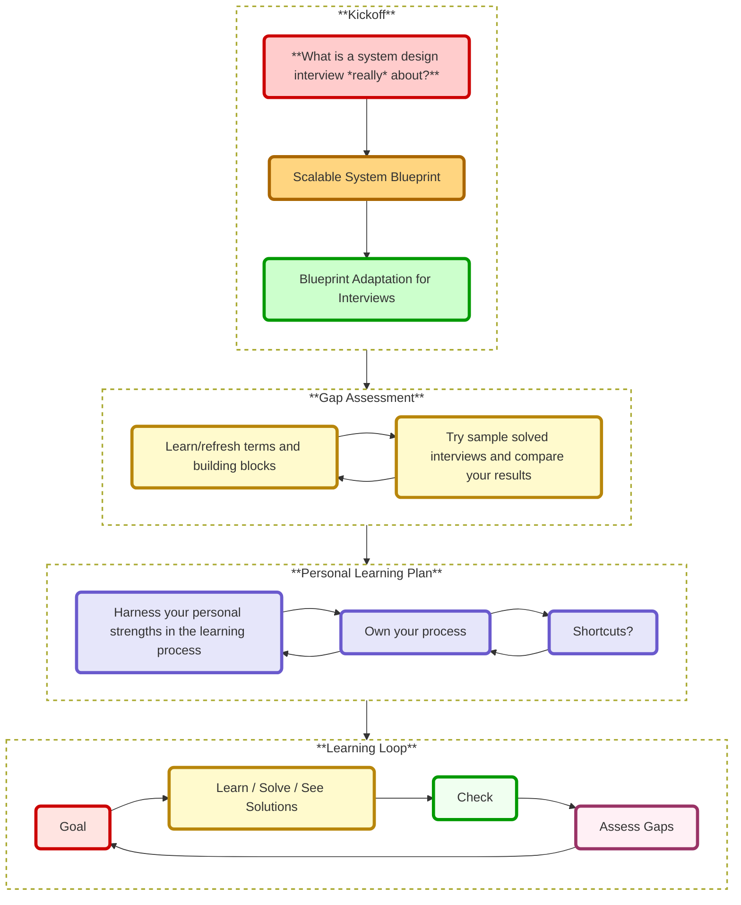

```mermaid
flowchart TB
  %% Kickoff container at top
  subgraph Kickoff["**Kickoff**"]
    direction TB
    style Kickoff stroke-dasharray:5,5,fill:none,stroke-width:2px
    A["**What is a system design interview *really* about?**"]
    B["Scalable System Blueprint"]
    C["Blueprint Adaptation for Interviews"]
  end

  %% Gap Assessment container
  subgraph GapAssessment["**Gap Assessment**"]
    direction LR
    style GapAssessment stroke-dasharray:5,5,fill:none,stroke-width:2px
    GA1["Learn/refresh terms and building blocks"]
    GA2["Try sample solved interviews and compare your results"]
  end

  %% Personal Plan container
  subgraph PersonalPlan["**Personal Learning Plan**"]
    direction LR
    style PersonalPlan stroke-dasharray:5,5,fill:none,stroke-width:2px
    PP1["Harness your personal strengths in the learning process"]
    PP2["Own your process"]
    PP3["Shortcuts?"]
  end


  %% Learning Loop container
  subgraph LearningLoop["**Learning Loop**"]
    direction LR
    style LearningLoop stroke-dasharray:5,5,fill:none,stroke-width:2px
    GapAnalysis["Goal"]
    LearnTry["Learn / Solve / See Solutions"]
    Test["Check"]
    Assess["Assess Gaps"]
  end


  %% Container flow
  Kickoff --> GapAssessment
  GapAssessment --> PersonalPlan
  PersonalPlan -->  LearningLoop


  %% Internal flows
  A --> B
  B --> C   

  GA1 --> GA2
  GA2 --> GA1
  PP1 --> PP2
  PP2 --> PP1
  PP2 --> PP3
  PP3 --> PP2

  GapAnalysis --> LearnTry --> Test --> Assess --> GapAnalysis

  %% Style nodes
  style A fill:#FFCCCC,stroke:#CC0000,stroke-width:4px,rx:6,ry:6
  style B fill:#FFD580,stroke:#AA6600,stroke-width:4px,rx:6,ry:6
  style C fill:#CCFFCC,stroke:#009900,stroke-width:4px,rx:6,ry:6

  style GA1 fill:#FFFACD,stroke:#B8860B,stroke-width:4px,rx:6,ry:6
  style GA2 fill:#FFFACD,stroke:#B8860B,stroke-width:4px,rx:6,ry:6

  style PP1 fill:#E6E6FA,stroke:#6A5ACD,stroke-width:4px,rx:6,ry:6
  style PP2 fill:#E6E6FA,stroke:#6A5ACD,stroke-width:4px,rx:6,ry:6
  style PP3 fill:#E6E6FA,stroke:#6A5ACD,stroke-width:4px,rx:6,ry:6


  style GapAnalysis fill:#FFE4E1,stroke:#CC0000,stroke-width:4px,rx:6,ry:6
  style LearnTry fill:#FFFACD,stroke:#B8860B,stroke-width:4px,rx:6,ry:6
  style Test fill:#F0FFF0,stroke:#009900,stroke-width:4px,rx:6,ry:6
  style Assess fill:#FFF0F5,stroke:#993366,stroke-width:4px,rx:6,ry:6
```

