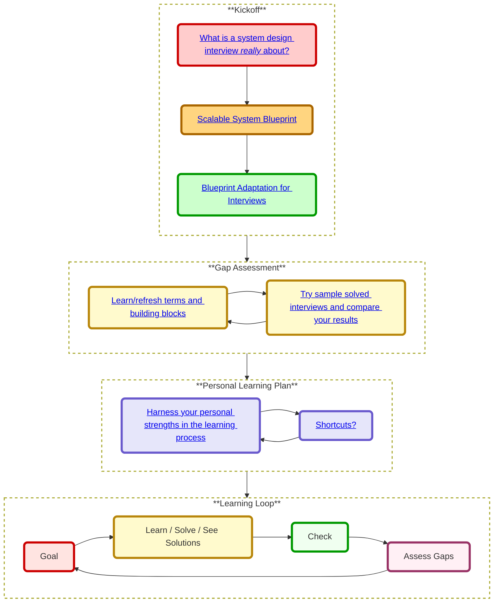

# Study Guide

## Understand What a System Design Interview Is *Really* About

Many interviewees fail the system design interview—not for lack of technical knowledge, but for misunderstanding what it’s really about.
Many candidates focus on memorizing architectures instead of engaging in a collaborative design **discussion**. In reality, interviewers want to see how you **lead** a targeted conversation to solve a **scoped problem**, not how fast you can sketch an entire production system.

### Key Principles

1. **Scope Is Your Responsibility.** You won’t build an entire production system in 45 minutes; instead, you should lead the conversation to define a manageable subset that simulates real-life constraints without overwhelming detail. Define a narrow, realistic scope—“Which core features should we prioritize?”—so you don’t drown in complexity.
2. **_Iterative_ problem framing.** The interviewer has an internal vision of scope and constraints. Your job is to uncover these via targeted questions and confirm alignment before diving deeper. Ask questions like, “What is our expected traffic volume?” or “Do we prefer latency over consistency?”
3. **Drive the Dialogue.** Unlike coding interviews where you follow prompts, take charge: propose direction ("shall we dive in?"), ideas, solicit feedback (“Does this design match your expectations?”), and iterate in real time.
4. **Pause for Buy‑In.** At every major phase—after outlining scope, after presenting your high‑level design, and after deep dives—restated assumptions ensure you and the interviewer are on the same page.
5. **Communicate Trade‑Offs.** As you dive into components, narrate your thought process: explain why you might choose sharding over caching or synchronous over asynchronous processing.
6. **Wrap Up with Confidence.** Summarize your solution, clarify any remaining uncertainties, and, if time permits, suggest potential improvements (e.g., monitoring metrics, auto‑scaling strategies).

> *A well‑structured system design interview isn’t about blurting out the “right” design—it’s about owning the conversation. Rather than simply answering, you must lead: ask clarifying questions, listen to sub text, expose hidden constraints, and keep the interviewer engaged. **Alex Xu’s four‑phase framework** helps you do just that.*

### KISS principle in system design

The KISS principle (Keep It Simple Stupid) is a design principle that states that systems should be simple and easy to understand.

What is system design ?

- Understand the problem and scope
- Break the problem into smaller problems (a.k.a. high level design)
- Solve the smaller problems (a.k.a. detailed design / deep dive) and combine them to solve the main problem

Therefore in an interview you need to demonstrate your ability on those 3 "domains".
However 

### Alex Xu’s four‑phase framework

**Phase 1: Understand the Problem & Establish Design Scope**  
- **Drive the dialogue with questions.** Who are our users? What scale do we expect? Which features matter most? Every question you ask both narrows scope and demonstrates leadership.  
- **Confirm alignment.** Restate constraints and assumptions back (“So we need to handle 10 M DAUs with ≤100 ms P99 latency, correct?”) to lock in buy‑in before diving deeper.

**Phase 2: Propose a High‑Level Design & Get Buy‑In**  
- **Sketch components at a glance.** Draw clients, gateways, services, data stores—just enough to show your initial blueprint architecture.  
- **Engage actively.** Rather than declaring “Here’s my design,” invite feedback: “Does this match what you had in mind?” If you sense any hesitation, ask “What part feels off?” to expose hidden expectations.
- **Think out loud.** Communicate your thoughts and make sure if you need to do back of the envelope calculations to validate your initial design.

**Phase 3: Deep Dive into Key Components**  
- **Select your hotspots.** Based on the feedback you got till here, usually you managed to get a good scope and direction for the deep dive, If this is not the case you need to try to ask more questions to get a better understanding of the problem. If after asking you still don't have a good direction, you can ask the interviewer for suggestions. Such as shall I talk about the main tradeoffs or focus on the areas with the most risk or complexity (e.g., caching, partitioning, queueing)?
- **Try not to get into unnecessary details** Focus on proving your ability to design scalable systems.
- **Validate continuously.** After each trade‑off discussion, check back: “Does that satisfy our latency goals given the consistency needs?”

**Phase 4: Wrap Up**  
- **Close the loop.** Ask, “Are there any areas you’d like me to revisit?” If there’s lingering doubt, probe its root and address it on the spot.
- **Recap of the design, and the feedback you got.** “We defined scope, sketched the system, deep‑dived on X and Y... however we understood that we need to revisit..., ”. This is important mainly if you had some design options to choose from.
- **Ask the interviewer's opinion about the next steps.**  
- **Propose other refinements if you have time.** e.g. Potential improvements, error cases, Operational issues (metrics). Note where you might shard more, add rate limiting, back‑pressure, or introduce caching layers as the workload grows.  

*By taking ownership of the conversation—asking clarifying questions, seeking continuous buy‑in, and guiding the interviewer through each phase—you transform a static Q&A into a **collaborative design session**. This is the approach that empowers you to steer a system design interview successfully.*

### References
1. **Exponent**, "5 Common System Design Interview Mistakes", 2023.
2. **Alex Xu**, *System Design Interview – An Insider's Guide*, Second Edition, 2020.
3. **GeeksforGeeks**, "Common Mistakes to Avoid in a System Design Interview".

---

## Scalable System Blueprint

---     

## Blueprint Adaptation for Interviews

### Back-of-the-envelope calculations

You might be asked to do some estimates by hand.  Refer to the [Appendix](14_back-of-the-envelope.md#appendix) for the following resources:

* [Use back of the envelope calculations](http://highscalability.com/blog/2011/1/26/google-pro-tip-use-back-of-the-envelope-calculations-to-choo.html)
* [Powers of two table](14_back-of-the-envelope.md#powers-of-two-table)
* [Latency numbers every programmer should know](14_back-of-the-envelope.md#latency-numbers-every-programmer-should-know)

---

## Gap Assessment

The system design interview is an **open-ended conversation**.  You are expected to lead it.

You can use the following steps to guide the discussion.  To help solidify this process, work through the [System design interview questions with solutions](#system-design-interview-questions-with-solutions) section using the following steps.

### Step 1: Outline use cases, constraints, and assumptions

Gather requirements and scope the problem.  Ask questions to clarify use cases and constraints.  Discuss assumptions.

* Who is going to use it?
* How are they going to use it?
* How many users are there?
* What does the system do?
* What are the inputs and outputs of the system?
* How much data do we expect to handle?
* How many requests per second do we expect?
* What is the expected read to write ratio?

### Step 2: Create a high level design

Outline a high level design with all important components.

* Sketch the main components and connections
* Justify your ideas

### Step 3: Design core components

Dive into details for each core component.  For example, if you were asked to [design a url shortening service](solutions/system_design/pastebin/README.md), discuss:

* Generating and storing a hash of the full url
    * [MD5](solutions/system_design/pastebin/README.md) and [Base62](solutions/system_design/pastebin/README.md)
    * Hash collisions
    * SQL or NoSQL
    * Database schema
* Translating a hashed url to the full url
    * Database lookup
* API and object-oriented design

### Step 4: Scale the design

Identify and address bottlenecks, given the constraints.  For example, do you need the following to address scalability issues?

* Load balancer
* Horizontal scaling
* Caching
* Database sharding

Discuss potential solutions and trade-offs.  Everything is a trade-off.  Address bottlenecks using [principles of scalable system design](index.md#index-of-system-design-topics).

---

## Personal Learning Plan

### Timeline matters
* **Short timeline** - Aim for **breadth** with system design topics.  Practice by solving **some** interview questions.
* **Medium timeline** - Aim for **breadth** and **some depth** with system design topics.  Practice by solving **many** interview questions.
* **Long timeline** - Aim for **breadth** and **more depth** with system design topics.  Practice by solving **most** interview questions.

| | Short | Medium | Long |
|---|---|---|---|
| Read through the [System design topics](index.md#index-of-system-design-topics) to get a broad understanding of how systems work | :+1: | :+1: | :+1: |
| Read through a few articles in the [Company engineering blogs](16_real_world_architectures.md#company-engineering-blogs) for the companies you are interviewing with | :+1: | :+1: | :+1: |
| Read through a few [Real world architectures](16_real_world_architectures.md#real-world-architectures) | :+1: | :+1: | :+1: |
| Review [How to approach a system design interview question](#how-to-approach-a-system-design-interview-question) | :+1: | :+1: | :+1: |
| Work through [System design interview questions with solutions](#system-design-interview-questions-with-solutions) | Some | Many | Most |
| Work through [Object-oriented design interview questions with solutions](#object-oriented-design-interview-questions-with-solutions) | Some | Many | Most |
| Review [Additional system design interview questions](15_interview questions.md#system-design-interview-questions) | Some | Many | Most |

---

## Learning Loop

---

# FAQ
**Q: For interviews, do I need to know everything here?**

**A: No, you don't need to know everything here to prepare for the interview**.

What you are asked in an interview depends on variables such as:

* How much experience you have
* What your technical background is
* What positions you are interviewing for
* Which companies you are interviewing with
* Luck

More experienced candidates are generally expected to know more about system design.  Architects or team leads might be expected to know more than individual contributors.  Top tech companies are likely to have one or more design interview rounds.

Start broad and go deeper in a few areas.  It helps to know a little about various key system design topics.  Adjust the following guide based on your timeline, experience, what positions you are interviewing for, and which companies you are interviewing with.

### Source(s) and further reading

Check out the following links to get a better idea of what to expect:

* [How to ace a systems design interview](https://www.palantir.com/2011/10/how-to-rock-a-systems-design-interview/)
* [The system design interview](http://www.hiredintech.com/system-design)
* [Intro to Architecture and Systems Design Interviews](https://www.youtube.com/watch?v=ZgdS0EUmn70)
* [System design template](https://leetcode.com/discuss/career/229177/My-System-Design-Template)

