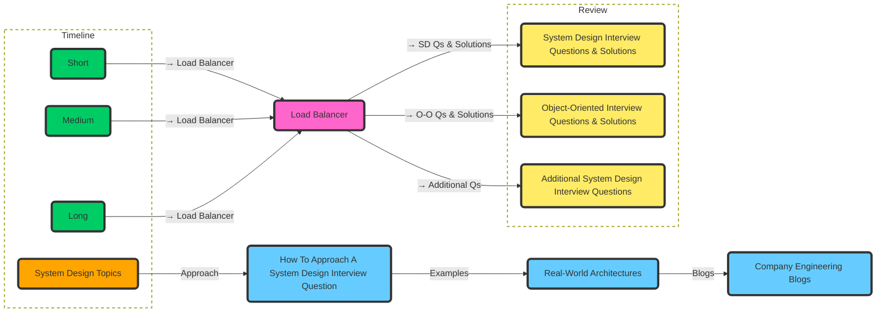
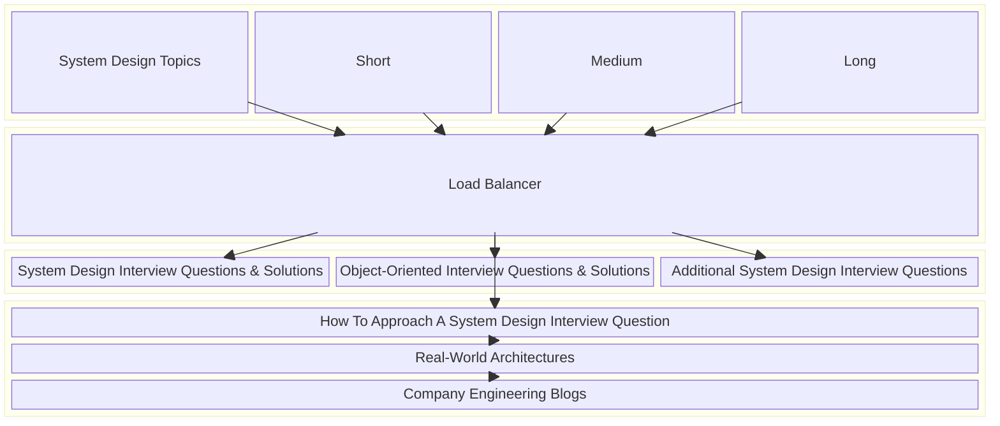
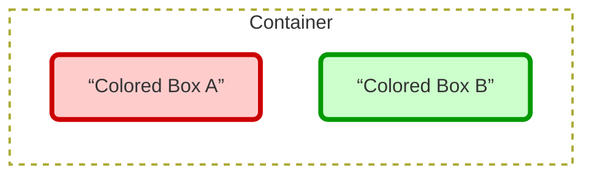

```mermaid
flowchart LR
  %% Timeline cluster
  subgraph Timeline
    direction LR
    A[System Design Topics]
    B[Short]
    C[Medium]
    D[Long]
  end
  style Timeline stroke-dasharray:5,5,fill:none,stroke-width:2px

  %% Node styles: fill, border, rounded corners
  style A fill:#FFA500,stroke:#333,stroke-width:4px,rx:6,ry:6
  style B fill:#00CC66,stroke:#333,stroke-width:4px,rx:6,ry:6
  style C fill:#00CC66,stroke:#333,stroke-width:4px,rx:6,ry:6
  style D fill:#00CC66,stroke:#333,stroke-width:4px,rx:6,ry:6

  %% Core node
  E[Load Balancer]
  style E fill:#FF66CC,stroke:#333,stroke-width:4px,rx:6,ry:6

  %% Edges: timeline -> Load Balancer
  B -->|"→ Load Balancer"| E
  C -->|"→ Load Balancer"| E
  D -->|"→ Load Balancer"| E

  %% Review cluster
  subgraph Review
    direction LR
    F[System Design Interview Questions & Solutions]
    G[Object-Oriented Interview Questions & Solutions]
    H[Additional System Design Interview Questions]
  end
  style Review stroke-dasharray:5,5,fill:none,stroke-width:2px

  style F fill:#FFEB66,stroke:#333,stroke-width:4px,rx:6,ry:6
  style G fill:#FFEB66,stroke:#333,stroke-width:4px,rx:6,ry:6
  style H fill:#FFEB66,stroke:#333,stroke-width:4px,rx:6,ry:6

  %% Edges: Load Balancer -> review topics
  E -->|"→ SD Qs & Solutions"| F
  E -->|"→ O-O Qs & Solutions"| G
  E -->|"→ Additional Qs"| H

  %% Right column: approach resources
  I[How To Approach A System Design Interview Question]
  style I fill:#66CCFF,stroke:#333,stroke-width:4px,rx:6,ry:6
  J[Real-World Architectures]
  style J fill:#66CCFF,stroke:#333,stroke-width:4px,rx:6,ry:6
  K[Company Engineering Blogs]
  style K fill:#66CCFF,stroke:#333,stroke-width:4px,rx:6,ry:6

  A -->|"Approach"| I
  I -->|"Examples"| J
  J -->|"Blogs"| K
```

```mermaid
block-beta
  columns 1

  block:Timeline
    columns 4
    A["System Design Topics"]
    B["Short"]
    C["Medium"]
    D["Long"]
  end

  block:Core
    E["Load Balancer"]
    A --> E
    B --> E
    C --> E
    D --> E
  end

  block:Review
    columns 3
    F["System Design Interview Questions & Solutions"]
    G["Object-Oriented Interview Questions & Solutions"]
    H["Additional System Design Interview Questions"]
    E --> F
    E --> G
    E --> H
  end

  block:Approach
    columns 1
    I["How To Approach A System Design Interview Question"]
    J["Real-World Architectures"]
    K["Company Engineering Blogs"]
    E --> I
    I --> J
    J --> K
  end
```

```mermaid
flowchart LR
  %%=== Dashed container ===
  subgraph Container
    direction TB
    %% the subgraph box itself is dashed:
    style Container stroke-dasharray:5,5,fill:none,stroke-width:2px
    A[“Colored Box A”]
    B[“Colored Box B”]
  end

  %%=== Style each node: fill, border thickness, rounded corners ===
  style A fill:#FFCCCC,stroke:#CC0000,stroke-width:4px,rx:6,ry:6
  style B fill:#CCFFCC,stroke:#009900,stroke-width:4px,rx:6,ry:6
```
