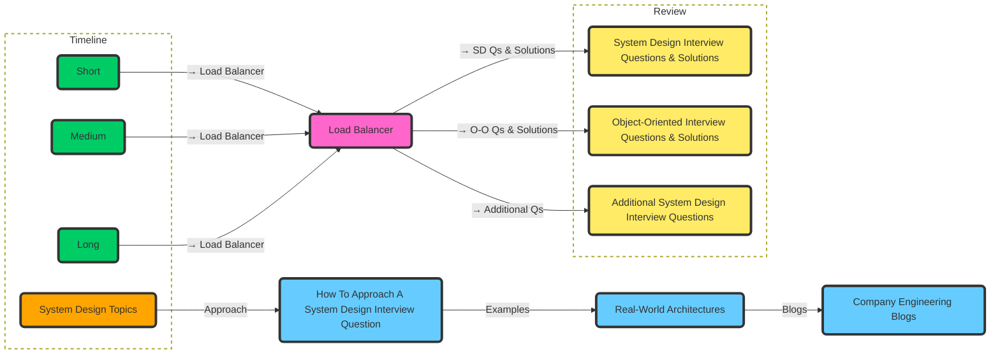
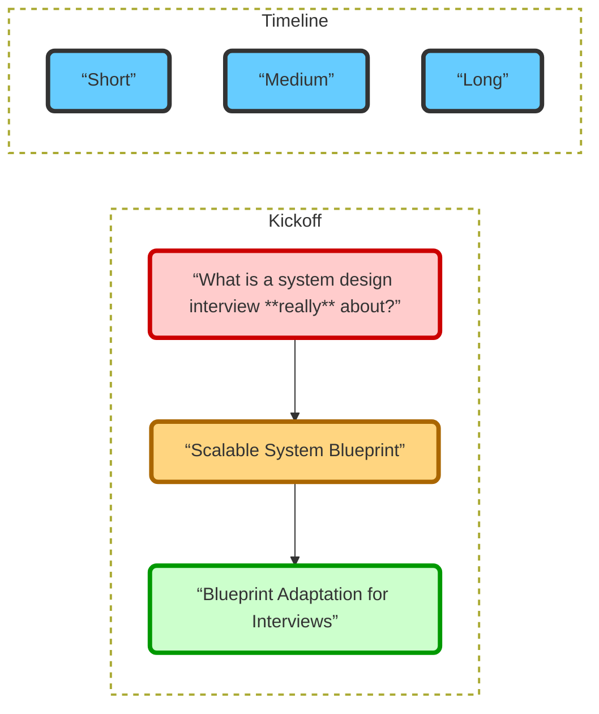

```mermaid
flowchart LR
  %% Timeline cluster
  subgraph Timeline
    direction LR
    A[System Design Topics]
    B[Short]
    C[Medium]
    D[Long]
  end
  style Timeline stroke-dasharray:5,5,fill:none,stroke-width:2px

  %% Node styles: fill, border, rounded corners
  style A fill:#FFA500,stroke:#333,stroke-width:4px,rx:6,ry:6
  style B fill:#00CC66,stroke:#333,stroke-width:4px,rx:6,ry:6
  style C fill:#00CC66,stroke:#333,stroke-width:4px,rx:6,ry:6
  style D fill:#00CC66,stroke:#333,stroke-width:4px,rx:6,ry:6

  %% Core node
  E[Load Balancer]
  style E fill:#FF66CC,stroke:#333,stroke-width:4px,rx:6,ry:6

  %% Edges: timeline -> Load Balancer
  B -->|"→ Load Balancer"| E
  C -->|"→ Load Balancer"| E
  D -->|"→ Load Balancer"| E

  %% Review cluster
  subgraph Review
    direction LR
    F[System Design Interview Questions & Solutions]
    G[Object-Oriented Interview Questions & Solutions]
    H[Additional System Design Interview Questions]
  end
  style Review stroke-dasharray:5,5,fill:none,stroke-width:2px

  style F fill:#FFEB66,stroke:#333,stroke-width:4px,rx:6,ry:6
  style G fill:#FFEB66,stroke:#333,stroke-width:4px,rx:6,ry:6
  style H fill:#FFEB66,stroke:#333,stroke-width:4px,rx:6,ry:6

  %% Edges: Load Balancer -> review topics
  E -->|"→ SD Qs & Solutions"| F
  E -->|"→ O-O Qs & Solutions"| G
  E -->|"→ Additional Qs"| H

  %% Right column: approach resources
  I[How To Approach A System Design Interview Question]
  style I fill:#66CCFF,stroke:#333,stroke-width:4px,rx:6,ry:6
  J[Real-World Architectures]
  style J fill:#66CCFF,stroke:#333,stroke-width:4px,rx:6,ry:6
  K[Company Engineering Blogs]
  style K fill:#66CCFF,stroke:#333,stroke-width:4px,rx:6,ry:6

  A -->|"Approach"| I
  I -->|"Examples"| J
  J -->|"Blogs"| K
```

```mermaid
flowchart LR
  %%=== Dashed container ===
  subgraph Kickoff
    direction TB
    %% the subgraph box itself is dashed:
    style Kickoff stroke-dasharray:5,5,fill:none,stroke-width:2px
    A[“What is a system design interview **really** about?”]
    B[“Scalable System Blueprint”] 
    C[“Blueprint Adaptation for Interviews”]  
  end

  %%=== Style each node: fill, border thickness, rounded corners ===
  style A fill:#FFCCCC,stroke:#CC0000,stroke-width:4px,rx:6,ry:6
  style B fill:#FFD580,stroke:#AA6600,stroke-width:4px,rx:6,ry:6
  style C fill:#CCFFCC,stroke:#009900,stroke-width:4px,rx:6,ry:6

  %% Edges: timeline -> Load Balancer
  A --> B
  B --> C


  subgraph Timeline
    direction TB
    %% the subgraph box itself is dashed:
    style Timeline stroke-dasharray:5,5,fill:none,stroke-width:2px
    D[“Short”]
    E[“Medium”] 
    F[“Long”]
  end

  %%=== Style each node: fill, border thickness, rounded corners ===
  style D fill:#66CCFF,stroke:#333,stroke-width:4px,rx:6,ry:6
  style E fill:#66CCFF,stroke:#333,stroke-width:4px,rx:6,ry:6
  style F fill:#66CCFF,stroke:#333,stroke-width:4px,rx:6,ry:6

```
