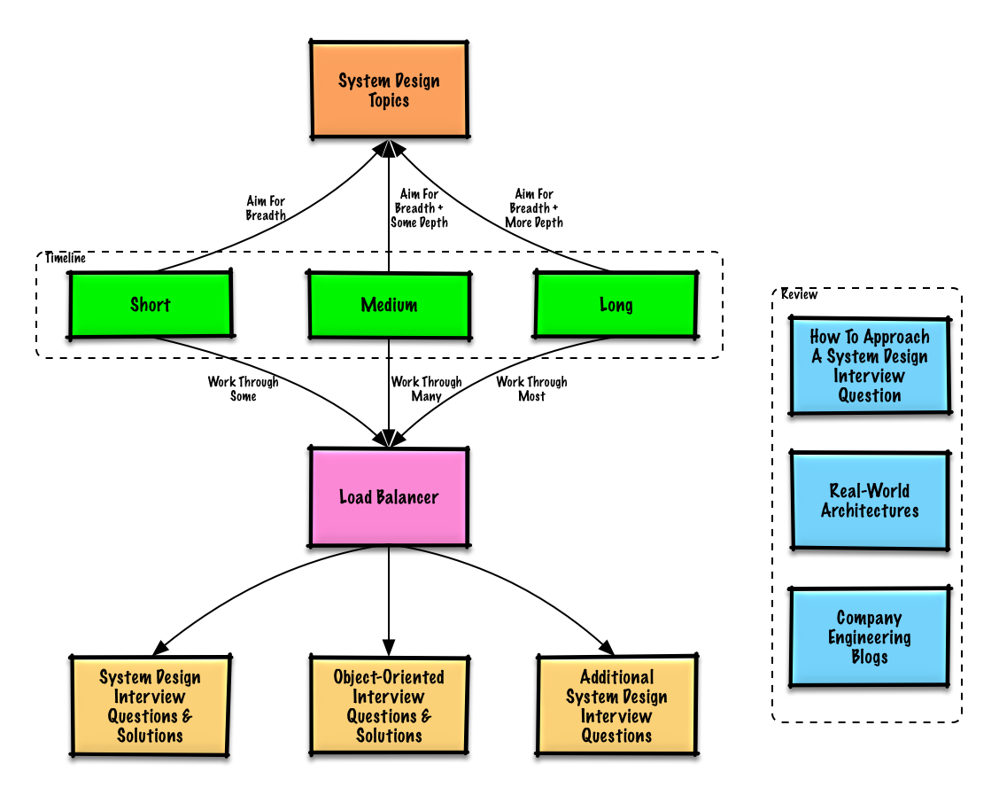
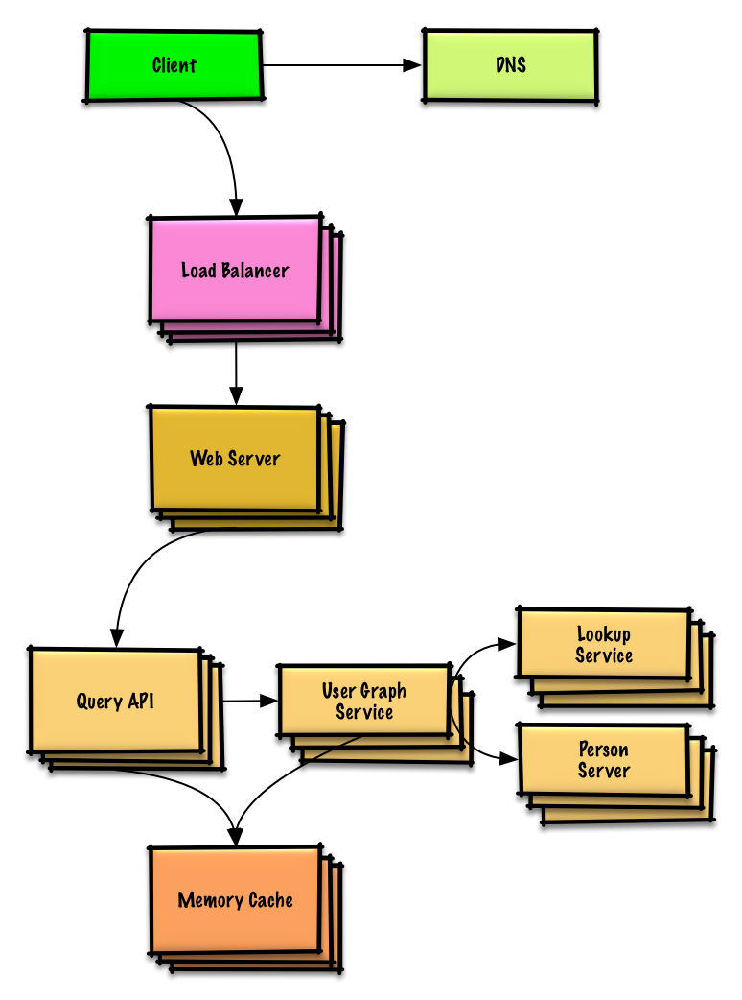

## Study guide

> Suggested topics to review based on your interview timeline (short, medium, long).

**Q: For interviews, do I need to know everything here?**

**A: No, you don't need to know everything here to prepare for the interview**.

What you are asked in an interview depends on variables such as:

* How much experience you have
* What your technical background is
* What positions you are interviewing for
* Which companies you are interviewing with
* Luck

More experienced candidates are generally expected to know more about system design.  Architects or team leads might be expected to know more than individual contributors.  Top tech companies are likely to have one or more design interview rounds.

Start broad and go deeper in a few areas.  It helps to know a little about various key system design topics.  Adjust the following guide based on your timeline, experience, what positions you are interviewing for, and which companies you are interviewing with.

* **Short timeline** - Aim for **breadth** with system design topics.  Practice by solving **some** interview questions.
* **Medium timeline** - Aim for **breadth** and **some depth** with system design topics.  Practice by solving **many** interview questions.
* **Long timeline** - Aim for **breadth** and **more depth** with system design topics.  Practice by solving **most** interview questions.

| | Short | Medium | Long |
|---|---|---|---|
| Read through the [System design topics](#index-of-system-design-topics) to get a broad understanding of how systems work | :+1: | :+1: | :+1: |
| Read through a few articles in the [Company engineering blogs](#company-engineering-blogs) for the companies you are interviewing with | :+1: | :+1: | :+1: |
| Read through a few [Real world architectures](#real-world-architectures) | :+1: | :+1: | :+1: |
| Review [How to approach a system design interview question](#how-to-approach-a-system-design-interview-question) | :+1: | :+1: | :+1: |
| Work through [System design interview questions with solutions](#system-design-interview-questions-with-solutions) | Some | Many | Most |
| Work through [Object-oriented design interview questions with solutions](#object-oriented-design-interview-questions-with-solutions) | Some | Many | Most |
| Review [Additional system design interview questions](#additional-system-design-interview-questions) | Some | Many | Most |

## How to approach a system design interview question

> How to tackle a system design interview question.

The system design interview is an **open-ended conversation**.  You are expected to lead it.

You can use the following steps to guide the discussion.  To help solidify this process, work through the [System design interview questions with solutions](#system-design-interview-questions-with-solutions) section using the following steps.

### Step 1: Outline use cases, constraints, and assumptions

Gather requirements and scope the problem.  Ask questions to clarify use cases and constraints.  Discuss assumptions.

* Who is going to use it?
* How are they going to use it?
* How many users are there?
* What does the system do?
* What are the inputs and outputs of the system?
* How much data do we expect to handle?
* How many requests per second do we expect?
* What is the expected read to write ratio?

### Step 2: Create a high level design

Outline a high level design with all important components.

* Sketch the main components and connections
* Justify your ideas

### Step 3: Design core components

Dive into details for each core component.  For example, if you were asked to [design a url shortening service](solutions/system_design/pastebin/README.md), discuss:

* Generating and storing a hash of the full url
    * [MD5](solutions/system_design/pastebin/README.md) and [Base62](solutions/system_design/pastebin/README.md)
    * Hash collisions
    * SQL or NoSQL
    * Database schema
* Translating a hashed url to the full url
    * Database lookup
* API and object-oriented design

### Step 4: Scale the design

Identify and address bottlenecks, given the constraints.  For example, do you need the following to address scalability issues?

* Load balancer
* Horizontal scaling
* Caching
* Database sharding

Discuss potential solutions and trade-offs.  Everything is a trade-off.  Address bottlenecks using [principles of scalable system design](#index-of-system-design-topics).

### Back-of-the-envelope calculations

You might be asked to do some estimates by hand.  Refer to the [Appendix](#appendix) for the following resources:

* [Use back of the envelope calculations](http://highscalability.com/blog/2011/1/26/google-pro-tip-use-back-of-the-envelope-calculations-to-choo.html)
* [Powers of two table](#powers-of-two-table)
* [Latency numbers every programmer should know](#latency-numbers-every-programmer-should-know)

### Source(s) and further reading

Check out the following links to get a better idea of what to expect:

* [How to ace a systems design interview](https://www.palantir.com/2011/10/how-to-rock-a-systems-design-interview/)
* [The system design interview](http://www.hiredintech.com/system-design)
* [Intro to Architecture and Systems Design Interviews](https://www.youtube.com/watch?v=ZgdS0EUmn70)
* [System design template](https://leetcode.com/discuss/career/229177/My-System-Design-Template)

## System design interview questions with solutions

> Common system design interview questions with sample discussions, code, and diagrams.
>
> Solutions linked to content in the `solutions/` folder.

| Question | |
|---|---|
| Design Pastebin.com (or Bit.ly) | [Solution](solutions/system_design/pastebin/README.md) |
| Design the Twitter timeline and search (or Facebook feed and search) | [Solution](solutions/system_design/twitter/README.md) |
| Design a web crawler | [Solution](solutions/system_design/web_crawler/README.md) |
| Design Mint.com | [Solution](solutions/system_design/mint/README.md) |
| Design the data structures for a social network | [Solution](solutions/system_design/social_graph/README.md) |
| Design a key-value store for a search engine | [Solution](solutions/system_design/query_cache/README.md) |
| Design Amazon's sales ranking by category feature | [Solution](solutions/system_design/sales_rank/README.md) |
| Design a system that scales to millions of users on AWS | [Solution](solutions/system_design/scaling_aws/README.md) |
| Add a system design question | [Contribute](#contributing) |

### Design Pastebin.com (or Bit.ly)

[View exercise and solution](solutions/system_design/pastebin/README.md)

### Design the Twitter timeline and search (or Facebook feed and search)

[View exercise and solution](solutions/system_design/twitter/README.md)

### Design a web crawler

[View exercise and solution](solutions/system_design/web_crawler/README.md)

### Design Mint.com

[View exercise and solution](solutions/system_design/mint/README.md)

### Design the data structures for a social network

[View exercise and solution](solutions/system_design/social_graph/README.md)

### Design a key-value store for a search engine

[View exercise and solution](solutions/system_design/query_cache/README.md)

### Design Amazon's sales ranking by category feature

[View exercise and solution](solutions/system_design/sales_rank/README.md)

### Design a system that scales to millions of users on AWS

[View exercise and solution](solutions/system_design/scaling_aws/README.md)

## Object-oriented design interview questions with solutions

> Common object-oriented design interview questions with sample discussions, code, and diagrams.
>
> Solutions linked to content in the `solutions/` folder.

>**Note: This section is under development**

| Question | |
|---|---|
| Design a hash map | [Solution](solutions/object_oriented_design/hash_table/hash_map.ipynb)  |
| Design a least recently used cache | [Solution](solutions/object_oriented_design/lru_cache/lru_cache.ipynb)  |
| Design a call center | [Solution](solutions/object_oriented_design/call_center/call_center.ipynb)  |
| Design a deck of cards | [Solution](solutions/object_oriented_design/deck_of_cards/deck_of_cards.ipynb)  |
| Design a parking lot | [Solution](solutions/object_oriented_design/parking_lot/parking_lot.ipynb)  |
| Design a chat server | [Solution](solutions/object_oriented_design/online_chat/online_chat.ipynb)  |
| Design a circular array | [Contribute](#contributing)  |
| Add an object-oriented design question | [Contribute](#contributing) |

