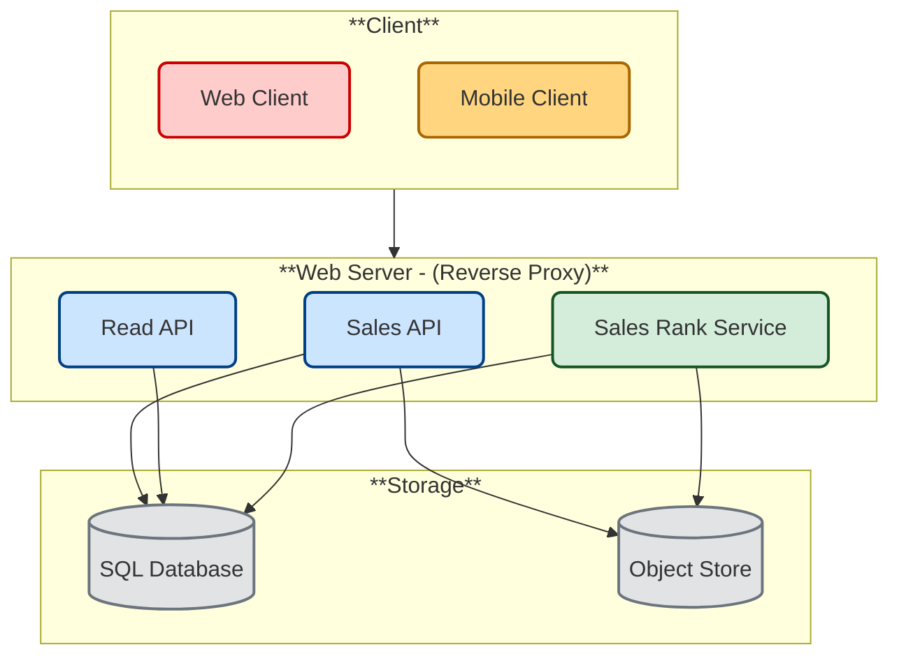
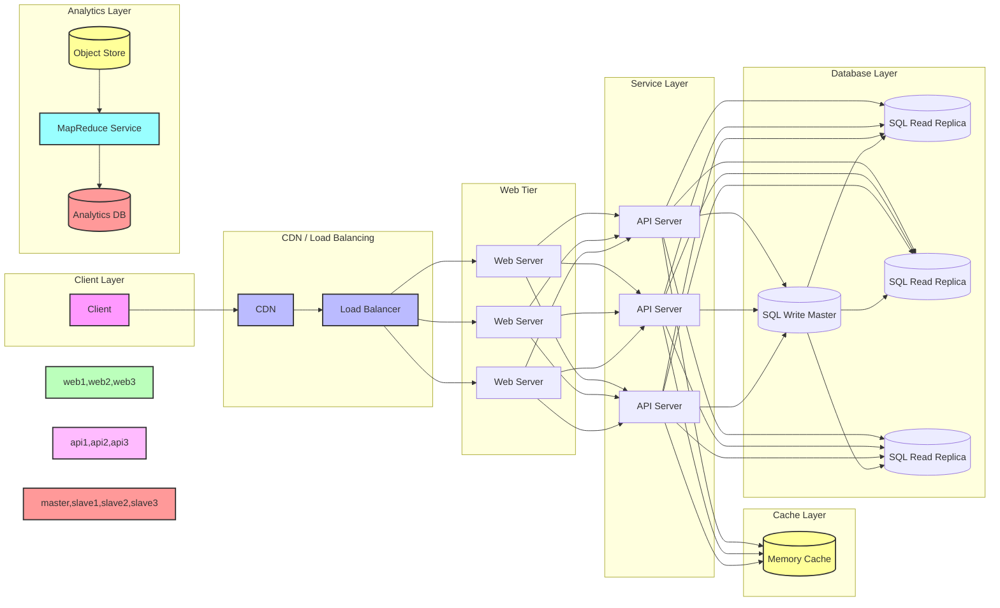

# Design Amazon's sales rank by category feature

*Note: This document links directly to relevant areas found in the [system design topics](https://github.com/ido777/system-design-primer-update#index-of-system-design-topics) to avoid duplication.  Refer to the linked content for general talking points, tradeoffs, and alternatives.*

## Step 1: Investigate the problem, use cases and constraints and establish design scope

> Gather main functional requirements and scope the problem.
> Ask questions to clarify use cases and constraints.
> Discuss assumptions.

Adding clarifying questions is the first step in the process.
Remember your goal is to understand the problem and establish the design scope.

### What questions should you ask to clarify the problem?


Here is an example of the dialog you could have with the Interviewer:

**Candidate:** Could you describe what exactly we need to design? Is this similar to Amazon's "Best Sellers" feature?
**Interviewer:** Yes, we want to design a system that tracks product sales and displays rankings by category, similar to Amazon's Best Sellers. The system should update rankings periodically based on sales data.
**Candidate:** I'd like to ask some questions about the scope and requirements:
1. What time period should we consider for the rankings?
2. How frequently do we need to update the rankings?
3. What's the scale we need to handle in terms of products and transactions?
4. Do we need real-time updates or is some delay acceptable?
**Interviewer:** Good questions.
- We want to track sales for the past week
- Rankings should update hourly
- We have about 10 million products across 1000 categories
- 1 billion transactions per month
- 100 billion read requests per month
**Candidate:** A few more questions:
1. Do we need to store historical rankings?
2. Should we consider seasonal trends or just raw sales numbers?
3. Are there any specific latency requirements for reading rankings?
**Interviewer:** 
- Historical rankings aren't required for now
- Just focus on raw sales numbers for now
- Rankings should be returned within 100ms

### Use Cases

Based on our discussion, here are the key use cases:

#### We'll scope the problem to handle only the following use case

1. **Service processes sales data**
    * Aggregate sales data by product and category
    * Update product rankings hourly
    * Track sales over a rolling 7-day window
2. **User requests product rank**
    * Get past week's top N products in a category
   
3. **Service has high availability**

#### Out of scope

* The general e-commerce site
    * Design components only for calculating sales rank
    * Historical rankings
    * Seasonal adjustments
    * Fraud detection
    * Product reviews/ratings integration

### Constraints and Assumptions

#### State Assumptions

* Traffic is not evenly distributed
* Items can be in multiple categories
* Items cannot change categories
* There are no subcategories ie `foo/bar/baz`
* Results must be updated hourly
    * More popular products might need to be updated more frequently


* 10 million products
* 1000 categories
* 1 billion transactions per month
* 100 billion read requests per month
* 100:1 read to write ratio

#### Calculate Usage

**Clarify with your interviewer if you should run back-of-the-envelope usage calculations.**

* Size per transaction:
    * `created_at` - 5 bytes
    * `product_id` - 8 bytes
    * `category_id` - 4 bytes
    * `seller_id` - 8 bytes
    * `buyer_id` - 8 bytes
    * `quantity` - 4 bytes
    * `total_price` - 5 bytes
    * Total: ~40 bytes
* 40 GB of new transaction content per month
    * 40 bytes per transaction * 1 billion transactions per month
    * 1.44 TB of new transaction content in 3 years
    * Assume most are new transactions instead of updates to existing ones
* 400 transactions per second on average
* 40,000 read requests per second on average

Handy conversion guide:

* 2.5 million seconds per month
* 1 request per second = 2.5 million requests per month
* 40 requests per second = 100 million requests per month
* 400 requests per second = 1 billion requests per month

## Step 2: Create a high level design & Get buy-in

> Outline a high-level design with all important components.


Here's our high-level design:



### Get buy-in

✅ Why This Breakdown?

Rather than diving into implementation, this diagram tells a story:

* It reflects usage patterns (100:1 read/write). This is why we have different components for write and read.
* It separates latency-sensitive vs. async processing. **Sales Rank Service** is async processing so it gets its own component.
* It shows readiness for growth without premature optimization. Write with load balancer, read with cache.

It creates a solid skeleton that supports further discussion on reverse proxy, caching, sharding, CDN integration, or even queueing systems for analytics—all while staying grounded in the problem as scoped.

You should ask for a feedback after you present the diagram, and get buy-in and some initial ideas about areas to dive into, based on the feedback.


## Step 3: Design core components

> Dive into details for each core component.

### Use case: Service calculates the past week's most popular products by category

**Clarify with your interviewer the expected amount, style, and purpose of the code you should write**.

We might discuss the [use cases and tradeoffs between choosing SQL or NoSQL](https://github.com/ido777/system-design-primer-update#sql-or-nosql). However we will use SQL for this design.


The core of our sales rank service is processing transaction data to generate rankings. Let's break down how this works:

#### Data Flow

1. **Transaction Ingestion**
   - Raw transaction logs are stored in the **Object Store** (like Amazon S3)
   - This is more cost-effective than managing our own distributed file system
   - Logs provide an immutable history we can reprocess if needed

2. **Log Format**
   Each log entry is tab-delimited with the following fields:
   ```
   timestamp   product_id  category_id    qty     total_price   seller_id    buyer_id
   t1          product1    category1      2       20.00         1            1
   t2          product1    category2      2       20.00         2            2
   t2          product1    category2      1       10.00         2            3
   t3          product2    category1      3        7.00         3            4
   t4          product3    category2      7        2.00         4            5
   t5          product4    category1      1        5.00         5            6
   ```

3. **Processing Pipeline**
   The **Sales Rank Service** uses **MapReduce** to process these logs and update the `sales_rank` table in the **SQL Database**. Here's how:

   - **Step 1: Map** - Transform raw logs into `(category, product), quantity` pairs
   - **Step 2: Reduce** - Sum quantities by category and product to get `(category, product_id), sum(quantity)`
   - **Step 3: Sort** - Sort products within each category by total quantity

Here's the implementation of our MapReduce job:

```python
class SalesRanker(MRJob):

    def within_past_week(self, timestamp):
        """Return True if timestamp is within past week, False otherwise."""
        ...

    def mapper(self, _ line):
        """Parse each log line, extract and transform relevant lines.

        Emit key value pairs of the form:
        (category1, product1), 2
        (category2, product1), 2
        (category2, product1), 1
        (category1, product2), 3
        (category2, product3), 7
        (category1, product4), 1
        """
        timestamp, product_id, category_id, quantity, total_price, seller_id, \
            buyer_id = line.split('\t')
        if self.within_past_week(timestamp):
            yield (category_id, product_id), quantity

    def reducer(self, key, value):
        """Sum values for each key.

        (category1, product1), 2
        (category2, product1), 3
        (category1, product2), 3
        (category2, product3), 7
        (category1, product4), 1
        """
        yield key, sum(values)

    def mapper_sort(self, key, value):
        """
        Input:
            key   = (category_id, product_id)
            value = quantity

        Output (emitted):
            (category_id, quantity), product_id        
        
        Construct key to ensure proper sorting.
        Transform key and value to the form:
        (category1, 2), product1
        (category2, 3), product1
        (category1, 3), product2
        (category2, 7), product3
        (category1, 1), product4

        The shuffle/sort step of MapReduce will then do a
        distributed sort on the keys, resulting in:
        (category1, 1), product4
        (category1, 2), product1
        (category1, 3), product2
        (category2, 3), product1
        (category2, 7), product3
        """
        category_id, product_id = key
        quantity = value
        # Emit a composite key so that:
        #   1. records are first grouped/sorted by category_id
        #   2. within each category, by ascending quantity        
        yield (category_id, quantity), product_id

    def reducer_identity(self, key, value):
        yield key, value

    def steps(self):
        """Run the map and reduce steps."""
        return [
            self.mr(mapper=self.mapper,
                    reducer=self.reducer),
            self.mr(mapper=self.mapper_sort,
                    reducer=self.reducer_identity),
        ]
```

The result would be the following sorted list:

```
(category1, 1), product4
(category1, 2), product1
(category1, 3), product2
(category2, 3), product1
(category2, 7), product3
```


4. **Data Storage**
   The results are stored in a `sales_rank` table with the following schema:

```sql
CREATE TABLE sales_rank (
    id INT NOT NULL AUTO_INCREMENT,
    category_id INT NOT NULL,
    product_id INT NOT NULL,
    total_sold INT NOT NULL,
    PRIMARY KEY(id),
    FOREIGN KEY(category_id) REFERENCES Categories(id),
    FOREIGN KEY(product_id) REFERENCES Products(id)
);

```
We'll create an [index](https://github.com/ido777/system-design-primer-update#use-good-indices) on `total_sold`, `category_id`, and `product_id`. Since indexes are typically implemented with B-trees, index lookup is O(log n) instead of O(n). Frequently accessed indexes (like by recent timestamps) are often cached automatically in RAM by the database's internal cache and since the indexes are smaller, they are likely to stay in memory. Reading 1 MB sequentially from memory takes about 250 microseconds, while reading from SSD takes 4x and from disk takes 80x longer.<sup><a href=https://github.com/ido777/system-design-primer-update.git#latency-numbers-every-programmer-should-know>1</a></sup>


### Use case: User views the past week's most popular products by category

When users want to view rankings, the flow is:

1. **Client Request**
   - **Client** sends request to **Web Server** (running as [reverse proxy](https://github.com/ido777/system-design-primer-update#reverse-proxy-web-server))
   - **Web Server** forwards to **Read API** server

2. **Data Retrieval**
   - **Read API** server queries the `sales_rank` table
   - Results are returned in ranked order

3. **API Interface**
   We expose a REST API for external clients:

   ```
   GET /api/v1/popular?category_id=1234
   ```

   Response:
   ```json
   [
       {
           "id": "100",
           "category_id": "1234",
           "total_sold": "100000",
           "product_id": "50"
       },
       {
           "id": "53",
           "category_id": "1234",
           "total_sold": "90000",
           "product_id": "200"
       },
       {
           "id": "75",
           "category_id": "1234",
           "total_sold": "80000",
           "product_id": "3"
       }
   ]
   ```

For internal communications, we could use [Remote Procedure Calls](https://github.com/ido777/system-design-primer-update#remote-procedure-call-rpc).

## Scale the design

> Identify and address bottlenecks, given the constraints.

<!-- Original image for reference:  -->




**Important: Do not simply jump right into the final design from the initial design!**

State you would:
1) **Benchmark/Load Test** - Identify bottlenecks
2) **Profile** - Get detailed performance data
3) **Address bottlenecks** - Propose and evaluate solutions
4) **Repeat** - The process is iterative
See [Design a system that scales to millions of users on AWS](../scaling_aws/README.md) as a sample on how to iteratively scale the initial design.


## Additional talking points

> Additional topics to dive into, depending on the problem scope and time remaining.

#### NoSQL

* [Key-value store](https://github.com/ido777/system-design-primer-update#key-value-store)
* [Document store](https://github.com/ido777/system-design-primer-update#document-store)
* [Wide column store](https://github.com/ido777/system-design-primer-update#wide-column-store)
* [Graph database](https://github.com/ido777/system-design-primer-update#graph-database)
* [SQL vs NoSQL](https://github.com/ido777/system-design-primer-update#sql-or-nosql)

### Caching

* Where to cache
    * [Client caching](https://github.com/ido777/system-design-primer-update#client-caching)
    * [CDN caching](https://github.com/ido777/system-design-primer-update#cdn-caching)
    * [Web server caching](https://github.com/ido777/system-design-primer-update#web-server-caching)
    * [Database caching](https://github.com/ido777/system-design-primer-update#database-caching)
    * [Application caching](https://github.com/ido777/system-design-primer-update#application-caching)
* What to cache
    * [Caching at the database query level](https://github.com/ido777/system-design-primer-update#caching-at-the-database-query-level)
    * [Caching at the object level](https://github.com/ido777/system-design-primer-update#caching-at-the-object-level)
* When to update the cache
    * [Cache-aside](https://github.com/ido777/system-design-primer-update#cache-aside)
    * [Write-through](https://github.com/ido777/system-design-primer-update#write-through)
    * [Write-behind (write-back)](https://github.com/ido777/system-design-primer-update#write-behind-write-back)
    * [Refresh ahead](https://github.com/ido777/system-design-primer-update#refresh-ahead)

### Asynchronism and microservices

* [Message queues](https://github.com/ido777/system-design-primer-update#message-queues)
* [Task queues](https://github.com/ido777/system-design-primer-update#task-queues)
* [Back pressure](https://github.com/ido777/system-design-primer-update#back-pressure)
* [Microservices](https://github.com/ido777/system-design-primer-update#microservices)

### Communications

* Discuss tradeoffs:
    * External communication with clients - [HTTP APIs following REST](https://github.com/ido777/system-design-primer-update#representational-state-transfer-rest)
    * Internal communications - [RPC](https://github.com/ido777/system-design-primer-update#remote-procedure-call-rpc)
* [Service discovery](https://github.com/ido777/system-design-primer-update#service-discovery)

### Security

Refer to the [security section](https://github.com/ido777/system-design-primer-update#security).

### Latency numbers

See [Latency numbers every programmer should know](https://github.com/ido777/system-design-primer-update#latency-numbers-every-programmer-should-know).

### Ongoing

* Continue benchmarking and monitoring your system to address bottlenecks as they come up
* Scaling is an iterative process
